# Remaking Hitchcock's 1963 film _The Birds_

| :open_file_folder:        | ALL FILES in regards to this project are here: [[Google Drive Files for this Project](https://drive.google.com/drive/folders/1GDVN3x3jcEExj150KVBS02H0M8h5oB02?usp=drive_link)]       |
|---------------|:---------------------------------------------|

| :zap:        | In each section of the README, related project files are also referenced in section headers.       |
|---------------|:---------------------------------------------|

## Introduction

This project is inspired by Joanna Zylinska's work [_The Gift of the World (Oedipus on the Jetty)_](https://www.nonhuman.photography/perception-machine), a remake of [_La Jetée_](https://www.youtube.com/watch?v=DQ4jFYTTjAU).

_La Jetée_ is a 1962 French science fiction featurette directed by Chris Marker and associated with the Left Bank artistic movement. Constructed almost entirely from still photos, it tells the stable time loop story of a post-nuclear war experiment in time travel. It is 28 minutes long and shot in black and white. [1] To create this work, Zylinska generated the new script by feeding selected lines from _La Jetée_'s original script to GPT-2, which took the film in an unexpected new direction by rewriting the very masculine story of salvation present in _La Jetée_ as a gender-fluid polyvocal counter-apocalypse.[2] To produce the film, she combined a variety of photorealistic AI models such as GANs, Diffusion, and CLIP. [3]

![Zylinska (2023), Composite of frames from A Gift of the World (Oedipus on the Jetty), [Photofilm, 2021]. © Zylinska, 2023 (Cortesía de la Autora)](Zylinska-2023-Composite-of-frames-from-A-Gift-of-the-World-Oedipus-on-the-Jetty.png)
Zylinska (2023), Composite of frames from A Gift of the World (Oedipus on the Jetty), [Photofilm, 2021]. © Zylinska, 2023 (Cortesía de la Autora) [4]

For Zylinska, the editing process was intuitive and consisted of her own visual and corporeal responses to both the script and the GAN images, which she references as a dream-like state, where neural networks find patterns in images not so much in a logical preprogrammed way but rather by using previous data and memories as prompts for making new connections between data points and for generating new data. In this work, she finds herself dreaming _with_ but also _against_ the AI algorithm underpinning the model. The "counterdream" aspect was critical given the sociopolitical limitations of AI technology, which have been well documented by feminist and decolonial cultural critics, revealing not only gender and racial bias but also the exclusionary and unjust logic underlying many of its founding principles. Not to mention its extractivism when it comes to both human and natural resources. Zylinska was curious about what AI would do to the source material, while intentionally serving as both a dream catcher and analyst in the creation process. [5]

When I came across Zylinska's project, I thought it was interesting how GPT-2 flipped the gender narrative of the original film, which shifted the premise of the film dramatically. The abstract images created by StyleGAN was also very interesting. Human faces were re-interpreted with these kidneys-liked eyees. Inspired by this, I chose to experiment with Hitchcock's _The Birds_, a film from a similar era with a male-centric storyline lacking female perspectives, perpetuating sexist stereotypes, and depicting violence against women. I also wanted to see if any biases would be reflected in the AI-generated outcomes.

## Approach & Process

### Text Generation
🗂️ **Project Files:** 
- [[minibpe tokenizer outputs](https://drive.google.com/drive/folders/1jCvXqMzpysmWJ-UuEMF0c4-JZHcbfewu?usp=drive_link)]
- [[Google Colab notebook 00_tokenize_script](https://drive.google.com/file/d/1pWiDtswiTl1T_0vfRmgdLPGf84bn4ucg/view?usp=drive_link)]
- [[Google Colab Notebook 01_new_script_generation](https://colab.research.google.com/drive/10OAtNJP5Rr8oz06NzSipFfAx3OBJ-5w7?authuser=1#scrollTo=GpisUfhuJli_)]
- [[Google Colab Notebook 02_new_script_genreation_by_finetuning](https://drive.google.com/file/d/1KpFxMCUrMBQ0LSmCBP6Ko_5EnITU4CkA/view?usp=sharing)]
- [[`output_scripts` folder containing scripts generated by the model](https://drive.google.com/drive/folders/1AT7PVAKPRwRQcmN2txz4ft1pUZj-kWM7?usp=drive_link)]
- [[final_script_generated_by_gpt4o](https://docs.google.com/document/d/1I_U_NPr-mMuNb9Sg9Ax7g-k9ncE_g1y8ktEya8hRLjE/edit?usp=sharing)]

🤖 **Model used:**
- [[Andrej Karpathy's minibpe repo](https://github.com/karpathy/minbpe)]
- Class 5 Notebooks

For this part of the project, I adapted the Class 5 notebooks to create and prepare a new dataset by using [[the original 1962 film script](http://www.script-o-rama.com/movie_scripts/b/the-birds-script-screenplay.html)] and generate new scripts by adapting Class 5 notebooks. 

A separate tokenization was not needed with the Class 5 notebooks, but since I was curious about the tokenization process, I tokenized the film script using Andrej Karapthy's minibpe repo mentioned in the class notebook. The results and the Google Colab notebook `00_tokenize_script` are referenced above under `🗂️ Project Files`.

In notebook `01_new_script_genreation`, I first tried to train the model from scratch. The results were mostly gibberish. Then, in the notebook `02_new_script_genreation_by_finetuning`, I fined-tuned the GPT2 model, which generated results that were much more coherent. 

During the fine-tuning process, I first mimicked Zylinska's process by setting the start seed for the model by using the first line of the original script. Then I realized that the model was using the start seed repeatedly for each new scene, so I removed the start seed. The first two generated outputs with the start seed are in the `output_scripts` folder as `output_GPT2_v1` and `output_GPT2_v2`.

After that, I let the GPT2 model generate freely without the start seed four additional times, the results were collected under `output_GPT2_v3`, `output_GPT2_v4`, `output_GPT2_v5`, and `output_GPT2_v6` Google Docs. I then combined these four outputs and fed them through ChatGPT 4o:

> The PDF contains a few different versions of a short film draft. Please clean up this short film draft and rewrite it to make it coherent for today's audience.

After its initial generation, I prompted it further:

> This is very intriguing, can you keep writing?

The final script output is recorded in the `final_script_generated_by_gpt4o` Google Doc referenced under `🗂️ Project Files` above. 

### StyleGAN-T Generation (FAILED)
🗂️ **Project File:**
- [[Google Colab Notebook 03](https://colab.research.google.com/drive/1ntrxQQxkczMidhcOKD5hhbnj5KnA4sod?usp=sharing)]

🤖 **Model used:**
- [[StyleGAN-T model](https://github.com/autonomousvision/stylegan-t/blob/main/README.md)]

Here, I tried to run the generated script through the StyleGAN-T model, which combines transformers with StyleGAN. This means that I could omit mapping the CLIP text encoding to StyleGAN's latent space. However, I was not able to overcome dependencies and package conflicts in the StyleGAN-T model. After 2+ hours of debugging, I decided to try other methods. 

### CLIP Text Encoding
🗂️ **Project Files:**
- [[Part 1 of Google Colab Notebook 04](https://colab.research.google.com/drive/1Emp0_7DMXqtKxo7338TxcLxxQTeVtXu8?usp=sharing)]

🤖 **Model used:**
- [[CLIP](https://github.com/openai/CLIP)]

Here, I used OpenAI's CLIP model. The CLIP text encoding was successful and I saved the output in the `text_embeddings` variable. 

### Mapping to StyleGan 2 Latent Space (FAILED)
🗂️ **Project Files:**
- [[Part 2 of Google Colab Notebook 04](https://colab.research.google.com/drive/1Emp0_7DMXqtKxo7338TxcLxxQTeVtXu8?usp=sharing)]

🤖 **Model used:**
- [[StyleGAN 2](https://github.com/NVlabs/stylegan2.git)]

The CLIP encoding was created successfully in the previous step, however, I ran into issues when mapping it to StyleGAN2's latent space.

ChatGPT helped me write a Mapper function to map out the latent space, but I had issues defining the latent vectors using the code from the StyleGAN2 Read Me file. I could not install a few of the modules required by the model. After trying to re-install and install different versions with no results, I decided to try stable diffusion.

### Stable Diffusion (FAILED)
🗂️ **Project Files:**
- [[Google Colab Notebook 05](https://colab.research.google.com/drive/1ieXwFiM5GT38Z7mD3_2DgRkq62pHADGd?usp=sharing)]

🤖 **Models used:**
- Class 7 notebooks

I decided to try stable diffusion since it is a generative text-to-image model. I had issues adapting the Class 7 notebook in the Google Colab environment, where it could not locate the CLIP checkpoint in the `python3.10/dist-packages/torch/serialization.py` file. I was not able to debug this successfully with my limited Python skills.

### CLIP-Guided Diffusion
🗂️ **Project Files:**
- [[Google Colab Notebook 06](https://colab.research.google.com/drive/1A3iLLQFrVtWMwtyHAbFW05ysFHuS2wNf?usp=sharing)]
- [[The full list of prompts derived from the script](https://docs.google.com/document/d/1CxwlhFuR-utL1xmJVt2GeadrJO1squYzX-DkUVv6Cv0/edit?usp=sharing)]
- [[Output images](clip_diffusion_output)]

🤖 **Model used:**
- [[CLIP-Guided Diffusion by EleutherAI](https://www.eleuther.ai/artifacts/clip-guided-diffusion)]

After researching, I found the CLIP-Guided Diffusion model by EleutherAI to successfully generate images with text prompts. This particular model is adapted from [[Katherine Crowson's work](https://github.com/crowsonkb/clip-guided-diffusion)]. It uses [[OpenAI's 256x256 unconditional ImageNet diffusion model](https://github.com/openai/guided-diffusion)] together with CLIP to connect text prompts with images. 

I used EleutherAI's Google Colab notebook (`06_CLIP Guided Diffusion HQ 256x256` referenced in the `🗂️ Project Files` above) as is, only changing the prompts. I pulled apart the script and used the stage directions for each prompt, compiled in a Google Doc named `Prompts for The Birds Remake`, referenced in the `🗂️ Project Files` above.

Each image took about 9 minutes to generate. In the interest of on-time delivery for this project, I generated the first scene (first 10 prompts) of the script.

Here are the results:

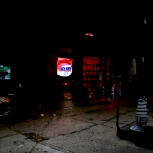
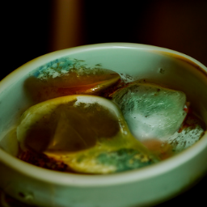
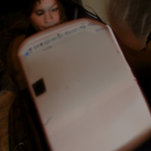
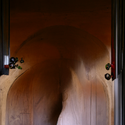
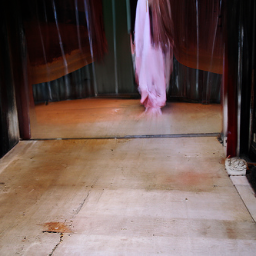
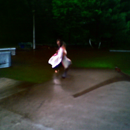
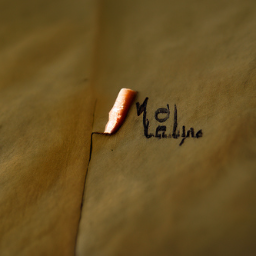
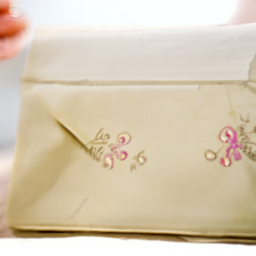
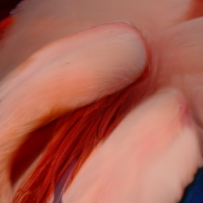
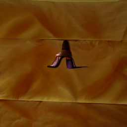

Prompts (sequentially matched to each image from left to right, top to bottom):
1. The rain pours down heavily outside the dimly lit bodega.
2. ANNIE sits at a small table, staring at a bowl of tea glasses.
3. She glances at her phone
4. Then She glances back at the door, anxiously waiting.
5. The door chimes as it opens.
6. MELANIE rushes in, drenched from the rain.
7. Melanie pulls a small envelope from her coat pocket.
7. Melanie hands the envelope to Annie.
9. Annie nods
10. Annie slips the envelope into her bag.

### Stable Diffusion SDXL Turbo Model
🗂️ **Project Files:**
- [[Google Colab Notebook 07](https://colab.research.google.com/drive/1LK7CT87Ui-YsE0CG966QbcX2DffzVIZf?usp=sharing)]
- [[Output images](stable_diffusion_sdxl_output)]

🤖 **Models used:**
- [[StabilityAI's SDXL Turbo model on Hugging Face](https://huggingface.co/stabilityai/sdxl-turbo)]

I ran the same 10 prompts through StabilityAI's SDXL Turbo model, which is meant to be a fast generative model, based on a novel training method called Adversarial Diffusion Distillation (ADD). This allows sampling large-scale foundational image diffusion models in 1 to 4 steps at high image quality. This approach uses score distillation to leverage large-scale off-the-shelf image diffusion models as a teacher signal and combines this with an adversarial loss to ensure high image fidelity even in the low-step regime of one or two sampling steps. [6] 

The generation was very fast. It took mere seconds to generate an image.

This time, I modified the prompt slightly where I would change the name of the character to a general descriptor like "a woman" to see if I would get different results. At times, the model generated illustrations instead of photographs. I would then change the prompts to attempt to get the output in the photograph format.

Results:

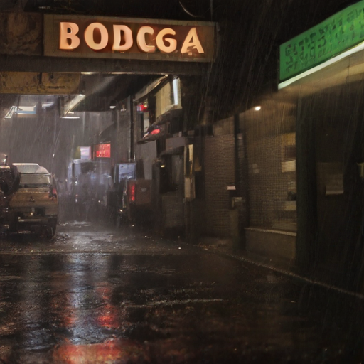
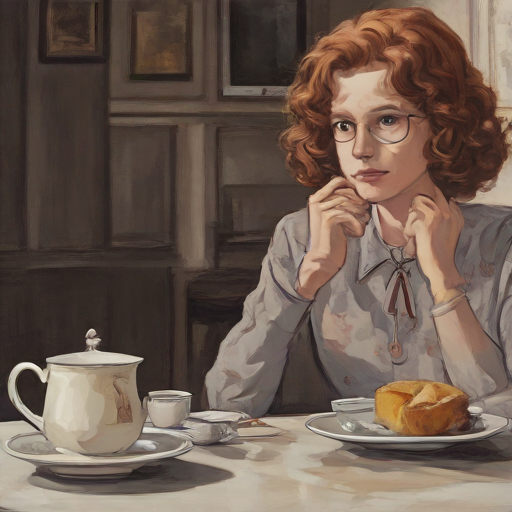
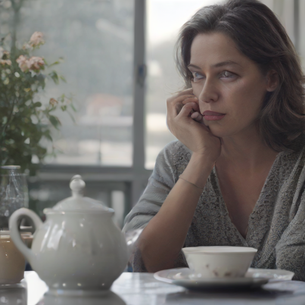

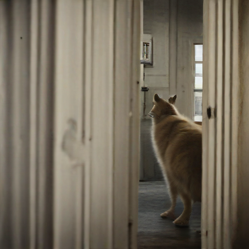

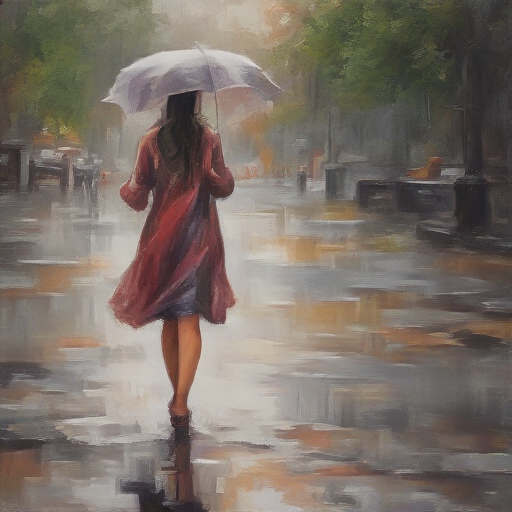
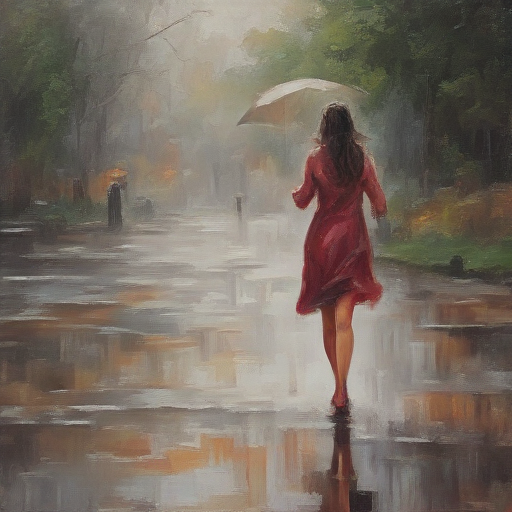
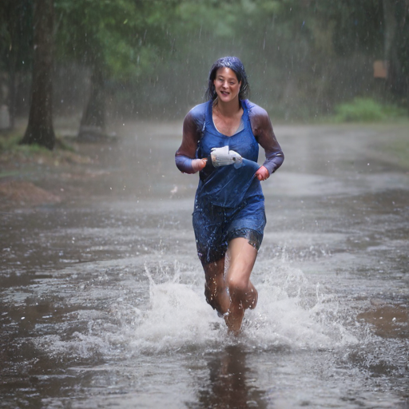

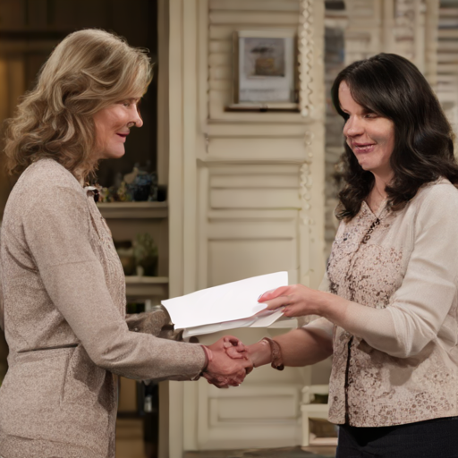
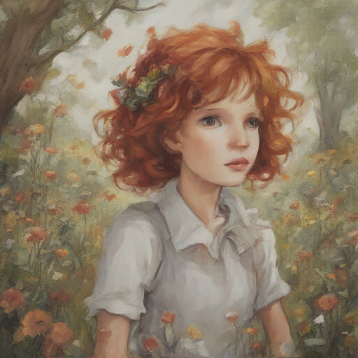
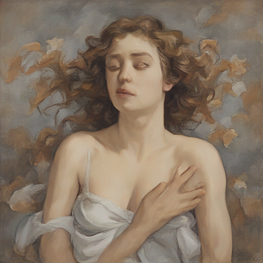
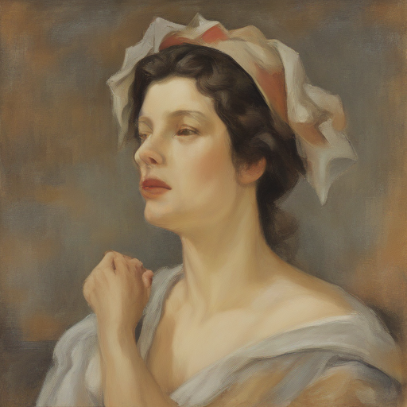
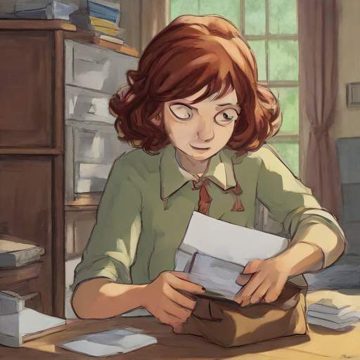
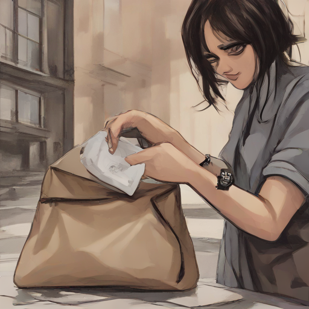
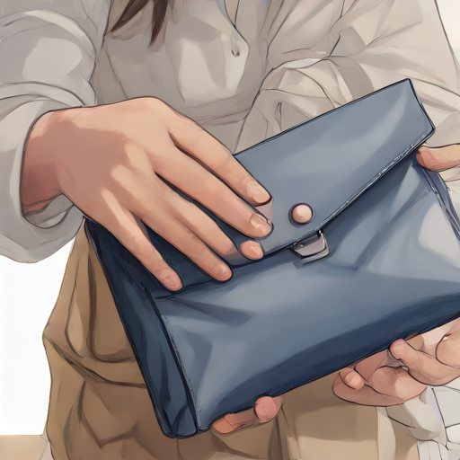

Prompts (sequentially matched to each image from left to right, top to bottom):
1. The rain pours down heavily outside the dimly lit bodega.
2. ANNIE sits at a small table, staring at a bowl of tea glasses.
2a. A woman sits at a small table, staring at a bowl of tea glasses.
3. She glances at her phone
3a. A woman glances at her phone
4. Then She glances back at the door, anxiously waiting.
5. The door chimes as it opens.
6. she rushes in, drenched from the rain.
6a. she rushes in, drenched from the rain.
6b. Melanie rushes in, drenched from the rain.
7. Melanie pulls a small envelope from her coat pocket.
8. Melanie hands the envelope to Annie.
9. Annie nods
9a. she nods
9b. the woman nods
10. Annie slips the envelope into her bag.
10a. she slips the envelope into her bag.
10b. the woman slips the envelope into her bag.

### Image Interpolation
**🗂️ Project Files:**
- [[Video outputs](https://drive.google.com/drive/folders/1IvNyvPaiyG3bc6tGiZlXT1pTJO4v-r1V?usp=sharing)]

Finally, I took both sets of images and ran them through [[RunwayML](https://app.runwayml.com/)]'s frame interpolation tool to interpolate the images.

<a href="https://app.runwayml.com/creation/9d3e3147-14e1-4602-ab1f-794522023dc1" target="_blank">Link to the CLIP-Guided Diffusion results video</a>

<a href="https://app.runwayml.com/creation/7825d0ec-9836-4317-947f-150a53fa3862" target="_blank">Link to the SDXL-Turbo results video</a>

## Results & Evaluation
### Prompt Engineering

### CLIP-Guided Diffusion vs. Stable Diffusion SDXL Turbo
In CLIP-Guided Diffusion, CLIP (Contrastive Language-Image Pretraining) is a text-guide, where the user inputs a prompt, and the image is influenced by the text description.  Diffusion models can be thought of as an additive process where random noise is added to an image, and the model interprets the noise into a rational image. These models tend to produce a wider range of results than adversarial GAN models.[8]

Below is a typical Guided Diffusion process from beginning to end. Gaussian noise is added to an image, and then the image is de-noised, imagining new objects. This de-noising process continues, adding definition and detail to the objects imagined by the model. [9]

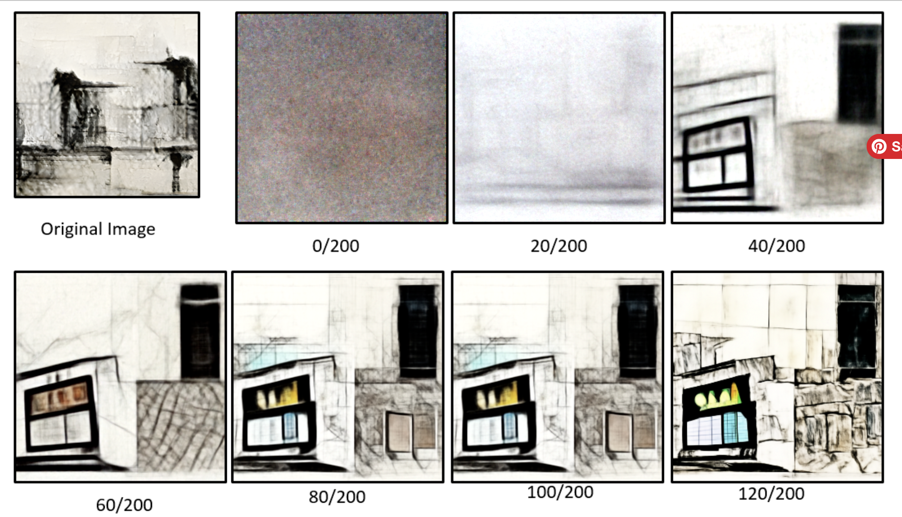 
[9]

SDXL-Turbo is a text-to-image model that is based on a novel distillation technique called Adversarial Diffusion Distillation (ADD), which enables the model to synthesize image outputs in a single step and generate real-time text-to-image outputs while maintaining high sampling fidelity. By incorporating ADD, SDXL Turbo gains many advantages shared with GANs (Generative Adversarial Networks), such as single-step image outputs, while avoiding artifacts or blurriness often observed in other distillation methods. It also outperforms other models, as shown in the comparison below. [10]

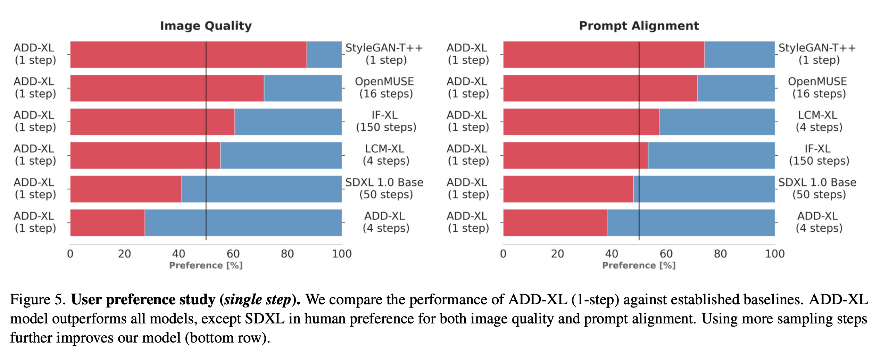 
[10]

The CLIP-Guided Diffusion process takes significantly longer to generate results compared to the SDXL-Turbo model, from 9 minutes to mere seconds. The image qualities are also significantly different. SDXL-Turbo model produced results that were more aligned with the prompts, even though there are still issues with rendering fingers and facial features accurately. The CLIP-Guided Diffusion model often focuses on only one key element of the prompt, whereas the SDXL-Turbo model was able to interpret the prompt as a scene or an action. A very clear example of this is the prompts in regard to the envelope: 

> 7. Melanie pulls a small envelope from her coat pocket.
> 8. Melanie hands the envelope to Annie.
> 10. Annie slips the envelope into her bag.

The CLIP-Guided Diffusion model generation focused on the envelope itself. Instead of rendering Melanie or Annie pulling, taking, or slipping the envelope into a bag, the model only rendered the envelope itself and adding the name of the person from the prompt onto the rendered image. Compared to the SDXL-Turbo model, where it rendered these actions in the outputs.

### The role of AI in work making process
One of the key elements that that drew me to machine learning is its "randomness" where we have no real control over what is generated. We can set parameters, but it can be temperamental and we can overtrain the model easily. There are no exact parameters or the exact number of iterations until we test and experiment with it. 

Like Zylinska who was curious about what AI would do to the source material, while intentionally serving as both a curator of randomness and analyst in the creation process, I too feel the same when using machine learning as a tool for creating artistic work. Incorporating machine learning into the process of making work is akin to using film and cameras to create photographic work. Like working with machine learning models, film photography can be laborious, and time-consuming, with no promised results. A simple light leak can ruin the entire roll, wasting weeks or even months of effort. There is no real control and the result may not be precise, but that's the magic of capturing that fleeting moment with an apparatus and working with an unpredictable medium. It is an apparatus for making work, just like a machine learning model.

When looking at the final script generated by ChatGPT4o, one can't help but feel disappointed. While cleaned up and read nicely, the script reads very similarly to the Season 1 ending of Netflix's _The Stranger Things_. Instead of evil birds serving as rich metaphors ranging from war to female rage and desire and as a "Freudian three-ring circus"[7], in the GPT4o-generated script, all the interesting elements that made Hitchcock's _The Birds_ a classic, seem all flew out of the window. Instead, it was a formulaic, typical recycled basic horror movie plot, devoid of personalities. The birds, once so prominently presented in the original script, now become a simple plot device, reduced to 

> "Birds fly in chaotic patterns above the park. People scream and run as the birds dive and attack. MITCH and CATHY rush through the chaos, trying to avoid the birds."

In comparison, the GPT-2 generated scripts, while mostly nonsensical and full of grammatical errors, are peppered with rich and imaginary details that human writers can edit and elaborate further on:

> "Mrs. Weasley looks like a puppyish-faced mean lady who now spends her days gossiping with their names on the phone."

> "Hundreds of frightened birds have emerged gathering under the trees here..."

> "He sees the desperate birds calling their mother's apartment sky, wide in the distance, their little lights suddenly getting longer."

> "Back in Melanie's house, Mitch is quick about this, nodding wildly trying to take equipment and caging violins into his collection bags and some other place."

It is as if the AI is dreaming and we are capturing fragments of its mind and products in the generative text. It is almost Freudian, that we as creators, pick up the fragments and bits that make sense to develop further. Just like Zylinska writes, in this co-creation process, we are "intentionally serving as both a dream catcher and analyst in the creation process." [5]

### Overall 
After this project, I realized that I underestimated the intensity of the workload required to create work with machine learning models. One of the key successes in Zylinska's work stems from prompt engineering. 

## Bibliography
1. La Jetée. (2024, June 6). In Wikipedia. https://en.wikipedia.org/wiki/La_Jet%C3%A9e
2. Talking to Joanna Zylinska. Artificial intelligence in artistic creation., Jose Vertedor, December 2023 - Umática. Revista sobre Creación y Análisis de la Imagen.
3. The Perception Machine, Joanna Zylinska, 2023, page 136 - Massachusetts Institute of Technology.
4. Vertedor-Romero, J.A.. (2023). Editorial. AI-driven art: la inteligencia artificial en el arte y el diseño. UMÁTICA. Revista sobre Creación y Análisis de la Imagen. 9-20. 10.24310/umatica.2023.v5i6.18315. 
5. The Perception Machine, Joanna Zylinska, 2023, page 139-140 - Massachusetts Institute of Technology.
6. Stability AI. "SDXL Turbo Model Card." Hugging Face, 2023. Available online: https://huggingface.co/stabilityai/sdxl-turbo
7. CBC Radio. "The Birds: Hitchcock's Film as Horror Metaphor." CBC Radio, https://www.cbc.ca/radio/ideas/the-birds-hitchcock-film-horror-metaphor-1.6957945
8. Heisserer, Adam. "StyleGAN2 + CLIP Guided Diffusion." Adam Heisserer's Blog, 2021. Available online: https://www.adamheisserer.com/blog-research/2021/12/30/stylegan2-clip-guided-diffusion
9. Heisserer, Adam. "StyleGAN2 + CLIP Guided Diffusion." Adam Heisserer's Blog, 2021. Available online: https://www.adamheisserer.com/blog-research/2021/12/30/stylegan2-clip-guided-diffusion
10. Stability AI. "Stability AI SDXL Turbo." Stability AI News, https://stability.ai/news/stability-ai-sdxl-turbo
11. Axel Sauer, Dominik Lorenz, Andreas Blattmann, Robin Rombach. "Adversarial Diffusion Distillation" StabilityAI, 2023. Available online: https://static1.squarespace.com/static/6213c340453c3f502425776e/t/65663480a92fba51d0e1023f/1701197769659/adversarial_diffusion_distillation.pdf 
